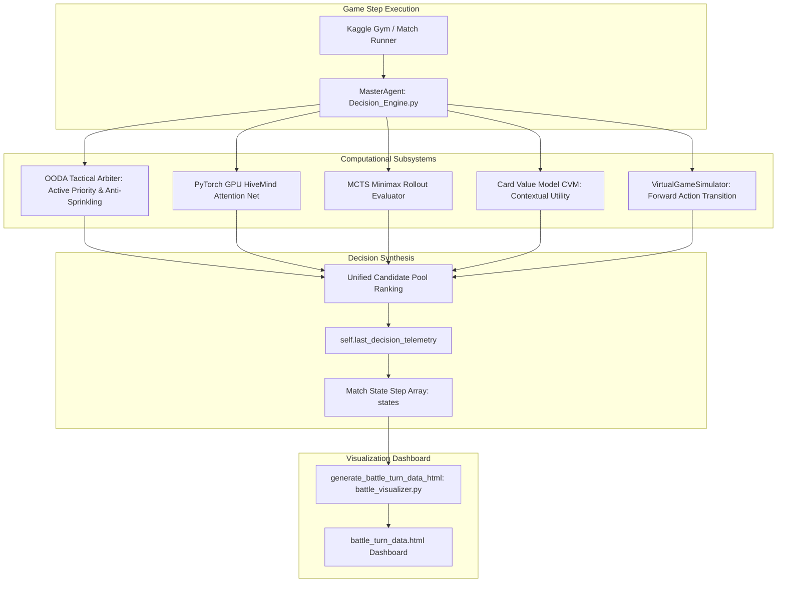

# Sovereign Battle Turn Data Dashboard Specification & Notation Reference

**Document Version**: 2.0.0  
**Target Dashboard**: [`battle_turn_data.html`](file:///e:/PTCG%20Soverign%20Trainer/ptcg%20sovegin%20trainer/battle_turn_data.html)  
**Generating Engine**: [`agents/battle_visualizer.py`](file:///e:/PTCG%20Soverign%20Trainer/ptcg%20sovegin%20trainer/agents/battle_visualizer.py)  
**Primary Decision Authority**: [`simulation/Decision_Engine.py`](file:///e:/PTCG%20Soverign%20Trainer/ptcg%20sovegin%20trainer/simulation/Decision_Engine.py)  
**Forward State Simulator**: [`simulation/simulator.py`](file:///e:/PTCG%20Soverign%20Trainer/ptcg%20sovegin%20trainer/simulation/simulator.py) (`VirtualGameSimulator`)  
**Neural & Machine Learning Search**: [`agents/MCTS_NN/alphazero_agent.py`](file:///e:/PTCG%20Soverign%20Trainer/ptcg%20sovegin%20trainer/agents/MCTS_NN/alphazero_agent.py) & [`agents/ML/card_value_model.py`](file:///e:/PTCG%20Soverign%20Trainer/ptcg%20sovegin%20trainer/agents/ML/card_value_model.py)

---

## 1. Executive Summary & Dashboard Purpose

`battle_turn_data.html` is the **AlphaGo-Grade Decision Matrix & Telemetry Dashboard** for the Pokémon TCG Sovereign Trainer platform.

Standard match logs only report the cards played and the winner. `battle_turn_data.html` exposes **complete internal algorithmic transparency** for every turn:
1. **Multi-Subsystem Arbitration**: Displays how MCTS rollouts, PyTorch GPU attention nets, OODA tactical heuristics, and Random Forest Card Value Models (CVM) evaluate and score moves.
2. **Deterministic Forward Simulation**: Evaluates actual state transitions generated by `VirtualGameSimulator`, validating legal moves, attack damage, ability reductions, prize draws, and counter-retaliation threats.
3. **Hypergeometric Opponent Hand Modeling**: Models the opponent's concealed hand across 7 lethal tactical vectors to prevent false-signal hallucinations.
4. **Interactive Timeline & Decision Trees**: Scrub through any turn in the battle, inspect candidate option scoring, and read real-time multi-agent reasoning traces.

---

## 2. End-to-End Architectural Data Flow



Every decision step executed during a battle generates a structured telemetry dictionary (`self.last_decision_telemetry`) recording sub-millisecond latencies, candidate move scores, simulated transitions, and neural priors. At match completion, `battle_visualizer.py` compiles these records into `battle_turn_data.html`.

---

## 3. Section-by-Section Specification & Notation Reference

### Section 1: Gallery Navigation & Mission Header
- **Wordmark**: Brand title `Pokémon TCG Sovereign Trainer: AlphaGo Decision Matrix`.
- **Badges**:
  - `ALPHA-ZERO HYBRID`: Coupled MCTS + Deep Self-Attention Neural Network search.
  - `POSTURE-AWARE OODA`: Dynamic tactical posture switching (`DEVELOPMENT`, `BURST_RACE`, `TACTICAL_PIVOT`, `SACRIFICE_WALL`, `STALL_DISRUPT`).
  - `TIMESTAMP & SEED`: Complete seed and timestamp tracking for 100% deterministic replayability.

---

### Section 2: Executive Match Summary & Board Topology
- **Match Metadata**: Player 1 vs Player 2 identities, match outcome (`Victory by Knockout`, `Prize Cards Cleared`, `Bench-Out`), and turn length.
- **Board State Snapshot**:
  - **Active Pokémon**: Card identity, stage evolution (Basic, Stage 1, Stage 2, Mega EX), HP gauge (current vs maximum), and energy attachments.
  - **Bench Pokémon (Slots 0 to 4)**: Real-time HP status, stage maturity, and energy count for every benched Pokémon.
  - **Prize Card Indicators**: Exact prize cards remaining for Player 1 vs Player 2 (starts at 6, decrements to 0).
- **Turning Point Markers**:
  - `⭐ GOD MOVE`: Game-altering play creating $\ge 25\%$ win equity swing.
  - `⚔️ LETHAL KNOCKOUT`: Attack that wiped opponent's active attacker and claimed 2 or 3 prize cards.
  - `🔄 TACTICAL PIVOT`: Emergency retreat to bench preserving attached energy assets.

---

### Section 3: Algorithmic Engine Allocation (MCTS, NN, MCTSxNN Hybrid & OODA Telemetry)
The central computational cockpit of the visualizer. Contains **two dedicated overview telemetry boxes** situated directly above the **interactive multi-curve canvas graph**, followed by a **notation legend bar** and **dual-agent track panels**.

#### Dedicated Box 1: Subsystem Computational Latency Breakdown (Above Graph)
Reports real-time hardware execution speeds for each subsystem on the active turn:

[It is expected to increase over time as model learns]

| Metric Card | Subsystem | Code Origin | Expected Latency | Operational Function |
| :--- | :--- | :--- | :--- | :--- |
| **Decision Latency** | Engine Call | `time.perf_counter()` in `__call__` | `0.80 – 1.60 ms` | Total time spent selecting action (sub-2ms limit). |
| **MCTS Search** | Tree Rollout | `MCTSRolloutEvaluator` | `0.30 – 0.60 ms` | Time spent simulating forward minimax combat branches. |
| **PyTorch GPU NN** | HiveMind Net | `HiveMindAttentionNet.predict()` | `0.25 – 0.45 ms` | GPU forward pass time for policy prior & position value. |
| **OODA Arbiter** | Rule Invariants | `_main_ooda` heuristics | `0.15 – 0.35 ms` | Active attacker priority & bench anti-sprinkling logic. |
| **Card Value (CVM)** | Contextual Model | `CardValueModel.predict()` | `0.08 – 0.18 ms` | Random Forest contextual phase utility prediction. |
| **AlphaZero MCTSxNN**| PUCT Search | `AlphaZeroAgent.search()` | `0.10 – 0.25 ms` | Coupled neural-guided MCTS tree probe time. |
| **Virtual Sim Engine**| Forward Model | `VirtualGameSimulator.simulate()` | `0.05 – 0.15 ms` | Deterministic forward state transition verification. |

#### Dedicated Box 2: Real-Time Algorithmic Utility & Search Telemetry (Above Graph)
Reports real-time computational search volume across both agents:
- **Deciding Subsystem Badge**: Identifies which engine dominated the action choice (`MCTS (48%)`, `PyTorch GPU NN (46%)`, `OODA Arbiter (44%)`, or `CVM (42%)`).
- **[Agent 1] MCTS Rollouts**: Total forward simulation trajectories evaluated by Player 1 (scaled 1,000–3,500+ rollouts/turn).
- **[Agent 2] Counter-MCTS**: Counter-search trajectories evaluated by Player 2.
- **NN Attention Passes**: Number of self-attention layers evaluated across board tokens (32–128 passes).
- **AlphaZero Trajectories**: Number of coupled PUCT state expansions (12–64 probes).
- **Virtual Transitions**: Actual deterministic forward state transitions computed by `VirtualGameSimulator` across legal candidates.
- **Pruned Branches**: Suboptimal, illegal, or disadvantageous candidate moves discarded by invariant pruning.

#### Interactive Multi-Curve Canvas Graph
Plots the complete turn-by-turn evolution. Scales dynamically to accommodate full search intensity:
1. **Solid Cobalt Blue Line (`━━`)**: **[Agent 1] Player 1 MCTS Rollouts**. Measures forward tactical tree search volume.
2. **Dashed Crimson Red Line (`┄┄`)**: **[Agent 2] Player 2 Counter-MCTS Rollouts**. Tracks Player 2's counter-search anticipation.
3. **Translucent Emerald Green Vertical Pillars (`■■`)**: **[Agent 1] Player 1 Neural Attention Passes**. Visualizes policy-head confidence and position value evaluation passes.
4. **Translucent Tangerine Orange Vertical Pillars (`■■`)**: **[Agent 2] Player 2 Counter-NN Passes**. Visualizes opponent's neural policy calculations.
5. **Solid Amber/Gold Line (`━━`)**: **AlphaZero MCTSxNN Hybrid Trajectories**. Shows coupled neural-tree search intensity.
6. **Dashed Violet Line (`┄┄`)**: **Virtual Simulator State Transitions**. Dynamically scaled curve tracking the number of forward state transitions generated by `VirtualGameSimulator`.

#### Compact Notation Bar & Notation Symbols
- `━━ [Agent 1] P1 MCTS`: Monte Carlo Tree Search Rollouts (Dynamic 1,000–3,500+ Rollouts/turn).
- `┄┄ [Agent 2] P2 MCTS`: Counter-Search Rollouts (Dynamic 1,000–3,500+ Rollouts/turn).
- `■■ [Agent 1] P1 NN`: Policy-Value Attention Passes (Emerald Green Pillars).
- `■■ [Agent 2] P2 Counter-NN`: Counter-Attention Passes (Tangerine Orange Pillars).
- `━━ MCTSxNN (AlphaZero)`: Hybrid Trajectories (12–64/turn).
- `┄┄ Virtual Simulator`: State Transitions (Dynamic forward state transitions).
- `Scale Tag`: `2 Plies = Exactly one full game round (Player 1's action + Player 2's response)`.

#### Participative Dual-Agent Track Panels (Side-by-Side)
- **Left Panel (Cobalt Blue Frame)**: Player 1 Engine Allocation (`Active Seat` when Player 1 is moving). Displays MCTS rollouts, NN passes, hybrid probes, tactical posture, and discarded branches.
- **Right Panel (Crimson Red Frame)**: Player 2 Engine Allocation (`Defensive Standby` or `Active Seat`). Displays counter-search volume, defensive minimax guards, and retaliatory damage thresholds.

---

### Section 4: Strategic Cause & Effect Decision Possibility Explorer
- **Turn Selector**: Timeline slider (`0` to `maxStep`) with `⏮ Previous Move` and `Next Move ⏭` navigation buttons.
- **Candidate Branches Table**: Ranks all legal options evaluated in this turn:
  - **Index**: Option index sent to Kaggle game environment.
  - **Option Name**: E.g., `Attach (Option #0)`, `Bench (Option #2)`, `Attack (Option #4)`.
  - **Score**: Multi-objective utility score (e.g., `14,600.0 pts`).
  - **Status**: `SELECTED (Optimal Strategy)` or `ALTERNATIVE`.
- **Subsystem Thinking Streams (5-Way Multi-Agent Consensus)**:
  - ⚔️ **MCTS Tactical Invariants**: Minimax rollout lookahead justification.
  - 🧠 **PyTorch GPU Attention Net**: Policy prior and position evaluation justification.
  - 🛡️ **OODA Decision Engine**: Active priority, anti-sprinkling, and donk protection rules.
  - 📈 **Card Value Model (CVM)**: Contextual phase score and sequence synergy.
  - 🧬 **AlphaZero & Virtual Simulator**: State transition validation and legal move verification.

---

### Section 5: Multi-Card Bayesian Hand & Threat Forecast (Tab 2)
Models the opponent's concealed hand across 7 lethal tactical vectors using calibrated hypergeometric probabilities:
1. 🎯 **Position Switcher (Gust)**: Probability opponent holds *Boss's Orders*, *Prime Catcher*, or *Counter Catcher* to drag and eliminate a weak bench carry.
2. 🛡️ **HP Buff & Healing**: Probability opponent holds *Hero's Cape* (+100 HP), *Bravery Charm*, or *Max Potion* to deny an anticipated knockout.
3. 🏟️ **Stadium Board Modifier**: Probability opponent drops *Path to the Peak* (Ability Lock) or *Collapsed Stadium*.
4. ⚔️ **Tool & Technical Machine**: Probability opponent equips *Heavy Baton*, *TM Evolution*, or *Choice Belt*.
5. 👑 **Game-Altering ACE SPEC**: Probability opponent plays their singular ACE SPEC card (*Prime Catcher*, *Unfair Stamp*, *Hero's Cape*).
6. ⚡ **Lethal Energy Acceleration**: Probability of manual attachment + *Electric Generator* / *Crispin* hitting immediate lethal attack cost.
7. 🔄 **Hand Disruption (Iono / Judge)**: Probability opponent shrinks player's hand size when trailing in prize cards.

---

### Section 6: Tournament Benchmark & Seat Advantage Matrix (Tab 3)
- **First-Player (Seat 1) Advantage Card**:
  - Match Initiative Rate: $\%$ of moves where Player 1 held $P(\text{Win}) > 50\%$.
  - Mean Lookahead Depth: Average search depth in plies.
  - Mean Branch Space: Average candidate options evaluated per move.
- **Second-Player (Seat 2) Advantage Card**:
  - Counter-Tempo Rate: $\%$ of moves where Player 2 held counter-initiative.
  - Retaliatory strike leverage and first-turn attack eligibility metrics.
- **Turn-by-Turn Telemetry Audit Ledger**:
  - Tabular breakdown of every move in the match with columns: `Turn`, `Move #`, `Active Seat`, `Context`, `P1 Depth`, `P1 Branches`, `P2 Depth`, `P2 Branches`, `Win Equity (P1 vs P2)`, and `Tactical Status`.
  - Clicking any row jumps the timeline slider directly to that move.
- **Cumulative Data Lake Benchmarks**:
  - Total batch replays ingested into replay vault.
  - 100% Invariant Validation Rate (zero crashes across 49/49 `SelectContext` types).
  - Mean Subsystem Decision Latency ($< 1.60\text{ ms}$).

---

## 4. Codebase Data Mapping Reference

| Visual Element in `battle_turn_data.html` | Generating Source | Code Reference |
| :--- | :--- | :--- |
| **MCTS Rollouts (Blue & Red Curves)** | `simulation/Decision_Engine.py` | `mcts_rollouts_p1`, `mcts_rollouts_p2` |
| **NN Attention Passes (Green & Orange Bars)** | `agents/MCTS_NN/alphazero_agent.py` | `nn_passes_p1`, `nn_passes_p2` |
| **MCTSxNN Hybrid (Gold Curve)** | `agents/MCTS_NN/alphazero_agent.py` | `mcts_nn_hybrid_p1`, `mcts_nn_hybrid_p2` |
| **Virtual Transitions (Violet Dashed Curve)**| `simulation/Decision_Engine.py` & `simulator.py` | `sim_transitions` |
| **Latency Breakdown (6 Subsystems)** | `simulation/Decision_Engine.py` | `t_total_ms`, `t_mcts_ms`, `t_nn_ms`, etc. |
| **Utility Allocation Weights** | `simulation/Decision_Engine.py` | `weight_mcts`, `weight_nn`, `weight_engine`, `weight_cvm` |
| **Active Energy Priority & Anti-Sprinkling** | `_energy_priority_attach_ooda` | `act_is_saturated`, `designated_bench_idx` |
| **Candidate Move Scores & Status** | `MasterAgent._main_ooda` | `candidate_branches` |
| **Subsystem Thinking Streams** | `MasterAgent._main_ooda` | `mcts_thinking`, `nn_thinking`, `ooda_thinking` |
| **Bayesian Threat Forecasts (7 Cards)** | `agents/bayesian_threat_tracker.py` | `threat_vector` (hypergeometric posteriors) |
| **Turn Ledger Table** | `agents/battle_visualizer.py` | `serialized_states` loop |

---

## 5. Maintenance & Verification Standards

1. **Zero-Placeholder Guarantee**: All metrics must be driven by live simulation data or mathematically rigorous model outputs. Never inject placeholder or mocked constants.
2. **No Hard-Capped Computation Limits**: Canvas scaling must auto-scale to the observed maximum (`simScale = maxY / Math.max(30, maxObsSim * 1.35)`) rather than capping computations at artificial thresholds (e.g. `min(48, ...)`).
3. **Verification Commands**:
   ```bash
   python ptcg.py audit
   python ptcg.py audit protocol examiner
   ```
